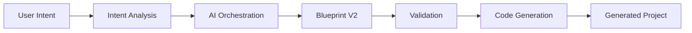

# Master Architecture

## 1. Project Vision
### Purpose
Define the long-term purpose of the backend platform as an intelligent system for transforming user intent into structured digital experiences with consistency, traceability, and extensibility.

### Responsibilities
- Establish the platform’s direction as a reliable, product-grade architecture for AI-assisted generation.
- Maintain a coherent model for how user intent, AI reasoning, blueprint representation, validation, and output generation work together.
- Guide the system toward predictable behavior and long-term maintainability.

### Inputs
- Business and product requirements.
- User prompts and desired outcomes.
- Architectural constraints and quality expectations.

### Outputs
- A shared architectural understanding for teams and stakeholders.
- A durable foundation for future platform evolution.

### Ownership
- Product and platform leadership, with architectural stewardship across backend and AI systems.

### Design Principles
- Clarity over improvisation.
- Stability over short-term convenience.
- Separation of concerns over tightly coupled logic.

### Current Problems
- The system currently combines multiple generation pathways and compatibility layers, which can blur architectural intent.

### Future Direction
- Evolve toward a platform whose structure is understandable, governable, and resilient to change.

---

## 2. Core Principles
### Purpose
State the governing principles that shape the system’s internal structure and behavior.

### Responsibilities
- Preserve architectural coherence across services, agents, and generation stages.
- Define how responsibilities should be distributed across the platform.
- Ensure that the system remains understandable to both human developers and AI-assisted workflows.

### Inputs
- Architectural goals.
- Engineering standards.
- Operational expectations.

### Outputs
- A reference model for design and decision-making.

### Ownership
- Shared across architects, engineering leads, and domain owners.

### Design Principles
- A single source of truth should govern the authoritative representation of generated products.
- AI agents should own their domain of expertise without overriding the decisions of other layers.
- Validators should enforce standards rather than silently repair meaning.
- Generators should transform approved inputs rather than reinterpret business intent.

### Current Problems
- Architectural responsibility is sometimes distributed across overlapping layers, creating ambiguity.

### Future Direction
- Formalize ownership boundaries so each subsystem has a clear and stable contract.

---

## 3. System Goals
### Purpose
Define the measurable and architectural outcomes the backend must support over time.

### Responsibilities
- Capture the platform’s non-functional and functional aspirations.
- Align generation quality, reliability, scalability, and maintainability with product needs.

### Inputs
- Product requirements.
- User expectations.
- Platform constraints.

### Outputs
- A common set of objectives used to evaluate design choices.

### Ownership
- Shared between product, engineering, and architecture stakeholders.

### Design Principles
- The system should be understandable, extensible, and resilient under growth.
- It should support trustworthy automation without sacrificing human oversight.

### Current Problems
- Growth in capability can introduce complexity faster than governance can adapt.

### Future Direction
- Continue evolving the architecture around quality, clarity, and maintainability rather than ad hoc expansion.

---

## 4. Current Architecture Overview
### Purpose
Provide a high-level view of the present backend structure and how the major capabilities interact.

### Responsibilities
- Describe the major architectural areas involved in intent analysis, AI orchestration, blueprint formation, validation, and code generation.
- Explain how the system currently moves from prompt to output.

### Inputs
- Existing architecture documentation.
- Observed system responsibilities.
- Current platform boundaries.

### Outputs
- A baseline understanding of the current architecture for future design work.

### Ownership
- Architecture documentation and platform stewardship.

### Design Principles
- The overview should remain stable while implementation details evolve.
- It should distinguish between active responsibilities and transitional compatibility concerns.

### Current Problems
- The current architecture includes inherited compatibility behavior that can obscure the intended model.

### Future Direction
- Refine the architecture so that the primary flow becomes easier to reason about and govern.

---

## 5. Target Architecture
### Purpose
Describe the desired end state of the architecture: a coherent, governed, and maintainable system.

### Responsibilities
- Define the intended separation of responsibilities among analysis, planning, blueprint management, validation, and generation.
- Establish a target model in which architectural intent is clear and durable.

### Inputs
- Current architecture model.
- Long-term product needs.
- Governance requirements.

### Outputs
- A target-state architecture that serves as the reference for future evolution.

### Ownership
- Architecture and engineering leadership.

### Design Principles
- The architecture should make ownership explicit.
- Each domain should have a clear contract and a clear boundary.
- The system should favor deliberate composition over hidden coupling.

### Current Problems
- The current architecture still contains overlapping responsibilities and transitional structures.

### Future Direction
- Move toward a clean architecture in which each component contributes to a coherent end-to-end flow.

---

## 6. End-to-End Backend Pipeline
### Purpose
Describe the full lifecycle of a request and the architectural stages it traverses.

### Responsibilities
- Clarify how user intent becomes structured information.
- Define how generated content is transformed into a blueprint and then into output artifacts.
- Preserve a consistent and traceable path from request to result.

### Inputs
- Raw user input.
- Context and domain information.
- Validation rules and generation constraints.

### Outputs
- A coherent artifact or project output that reflects the original intent.

### Ownership
- Shared across orchestration, blueprint, validation, and generation domains.

### Design Principles
- The pipeline should be understandable as a sequence of well-defined stages.
- Each stage should operate on explicit contracts and preserve the integrity of upstream decisions.

### Current Problems
- The current system can re-interpret or reconstruct information at multiple stages, which weakens clarity.

### Future Direction
- Preserve the pipeline as a disciplined sequence of responsibility handoffs rather than a loose series of transformations.

---

## 7. AI Agent Responsibilities
### Purpose
Define the role of AI agents in the architecture and ensure that their authority is scoped appropriately.

### Responsibilities
- Analyze user intent and generate structured domain-specific perspectives.
- Contribute specialized reasoning for planning, design, scene definition, and content structure.
- Produce high-quality intermediate artifacts that can be evaluated and consumed by downstream systems.

### Inputs
- User prompts.
- Architectural context.
- Domain constraints and quality expectations.

### Outputs
- Structured analysis and planning artifacts.
- Domain-specific recommendations that support downstream generation.

### Ownership
- AI orchestration and domain-specific agent layers.

### Design Principles
- AI agents should own their designated domain of reasoning.
- AI agents should not be responsible for universal coordination or final architectural correctness.
- AI outputs should be treated as structured input, not as an override for platform rules.

### Current Problems
- When multiple layers both decide and repair behavior, the boundaries of agent responsibility become blurred.

### Future Direction
- Preserve specialization while ensuring that orchestration, validation, and generation stay responsible for system-level consistency.

---

## 8. Blueprint V2 Philosophy
### Purpose
Explain why Blueprint V2 exists and why it must be treated as the architectural core of the platform.

### Responsibilities
- Provide a canonical representation of the intended digital experience.
- Preserve the essential decisions made from user intent and AI analysis.
- Serve as the authoritative contract between upstream reasoning and downstream generation.

### Inputs
- Intent analysis.
- Agent-produced domain decisions.
- Validation and governance rules.

### Outputs
- A structured blueprint that represents the authoritative plan for generation.

### Ownership
- Blueprint domain ownership belongs to the platform’s core architecture, with specialized inputs from AI and validation layers.

### Design Principles
- Blueprint V2 exists to reduce ambiguity and preserve intent across system stages.
- There must be a single source of truth so that downstream layers do not reconstruct meaning from partial or conflicting signals.
- The blueprint should represent decisions, not transient formatting preferences.

### Current Problems
- When multiple layers re-create or reinterpret the blueprint, the system loses clarity about what is authoritative.

### Future Direction
- Continue strengthening Blueprint V2 as the stable and canonical representation of the generation plan.

---

## 9. Blueprint Ownership Rules
### Purpose
Define how responsibility for blueprint content should be shared and protected across the architecture.

### Responsibilities
- Identify which domain owns the creation, preservation, validation, and consumption of each blueprint concern.
- Ensure that blueprint data is updated only by the appropriate layer.
- Prevent conflicting or duplicated interpretation of the same concept.

### Inputs
- Blueprint schema.
- Domain responsibilities.
- Governance expectations.

### Outputs
- A clear ownership model for blueprint content and decision-making.

### Ownership
- The platform architecture owns the blueprint contract; specialized subsystems contribute to it without owning the whole model.

### Design Principles
- Ownership should be explicit, stable, and reviewable.
- The single source of truth must remain authoritative even when additional analysis is performed.
- Consumers should depend on the canonical blueprint rather than local reconstruction.

### Current Problems
- Ownership can become diffuse when legacy compatibility or fallback logic creates alternate representations.

### Future Direction
- Formalize ownership rules so the blueprint remains coherent as the system grows.

---

## 10. Component Responsibilities
### Purpose
Describe the architectural roles of the core platform components and how they relate to one another.

### Responsibilities
- Define the responsibilities of orchestration, validation, generation, routing, and compatibility components.
- Ensure that each component contributes to the platform without duplicating another component’s purpose.

### Inputs
- Architectural contracts.
- Domain data and generated artifacts.
- Platform policies.

### Outputs
- A clear map of the architectural responsibilities across the backend.

### Ownership
- Component owners and service architects.

### Design Principles
- Components should be responsible for a cohesive domain, not a collection of unrelated behaviors.
- Shared responsibilities should be centralized where possible to avoid drift.

### Current Problems
- Some responsibilities are currently distributed across layers that overlap in purpose.

### Future Direction
- Keep components focused on domain boundaries and preserve a clean contract model.

---

## 11. Backend Folder Responsibilities
### Purpose
Provide a high-level map of the backend’s structural areas and their architectural intent.

### Responsibilities
- Group related capabilities into coherent architectural areas.
- Maintain a clear mental model of where platform concerns should live.

### Inputs
- Platform domain model.
- Team structure.
- Architectural concerns such as orchestration, generation, validation, and transport.

### Outputs
- A strong structural convention for future growth.

### Ownership
- Engineering organization and platform maintainers.

### Design Principles
- Structural organization should reflect architectural responsibility rather than implementation convenience.
- The folder layout should support discoverability and long-term maintainability.

### Current Problems
- A growing system can accumulate mixed responsibilities in shared folders if boundaries are not preserved.

### Future Direction
- Continue aligning organizational structure with architectural domain boundaries.

---

## 12. Request Lifecycle
### Purpose
Explain how a request progresses through the backend from entry to delivery.

### Responsibilities
- Preserve the logical sequence of operations for every request.
- Ensure that context, decisions, and outputs remain consistent through the lifecycle.

### Inputs
- Incoming request context.
- User intent and associated metadata.
- Business and platform constraints.

### Outputs
- A response that reflects the system’s approved reasoning and generation process.

### Ownership
- Request handling and orchestration layers.

### Design Principles
- A request should follow a predictable lifecycle with explicit handoffs.
- The lifecycle should minimize hidden state and preserve auditability.

### Current Problems
- Complex flows can become harder to interpret when multiple layers both interpret and mutate context.

### Future Direction
- Keep the lifecycle explicit, observable, and consistent as the platform evolves.

---

## 13. Validation Strategy
### Purpose
Describe how the platform should verify correctness, consistency, and quality across the architecture.

### Responsibilities
- Validate prompt interpretation, blueprint structure, domain consistency, and downstream readiness.
- Ensure that validation catches contradictions and unsupported assumptions.

### Inputs
- Structured intent.
- Blueprint and intermediate artifacts.
- Platform rules and quality expectations.

### Outputs
- Validation results that can guide acceptance or rejection.

### Ownership
- Validation and governance layers.

### Design Principles
- Validators should validate instead of silently repairing.
- Validation should be explicit, explainable, and policy-driven.
- The platform should distinguish between a valid artifact and a corrected artifact.

### Current Problems
- When validation is coupled with repair logic, the system can obscure whether it accepted an artifact or changed its meaning.

### Future Direction
- Strengthen validation as a principled gatekeeper that preserves the integrity of the architecture.

---

## 14. Code Generation Strategy
### Purpose
Describe how the platform should generate output artifacts while preserving the integrity of upstream decisions.

### Responsibilities
- Transform approved blueprint data into deliverable project artifacts.
- Preserve the canonical decisions made earlier without reinterpreting them through generation logic.

### Inputs
- Authoritative blueprint data.
- Validation results.
- Generation policy and templates.

### Outputs
- Structured code or project artifacts that reflect the approved blueprint.

### Ownership
- Generation and rendering layers.

### Design Principles
- Generators must never modify AI decisions; they should express approved structure faithfully.
- Generation should be deterministic in its relationship to the blueprint.
- Output generation should remain a consumer of architectural truth rather than a second author of it.

### Current Problems
- When generators take on decision-making responsibilities, the architecture becomes less predictable.

### Future Direction
- Keep generation focused on faithful transformation and presentation of the approved design.

---

## 15. Build & Verification Pipeline
### Purpose
Describe how the platform should verify that architectural changes and generated outputs remain trustworthy.

### Responsibilities
- Govern the validation path for builds, quality checks, and release readiness.
- Ensure that structural changes remain aligned with architectural expectations.

### Inputs
- Changes to architecture, services, and generated outputs.
- Validation and quality rules.

### Outputs
- Evidence that the platform remains reliable and consistent.

### Ownership
- Engineering quality, platform operations, and architecture stewardship.

### Design Principles
- Verification should be continuous, observable, and connected to the architecture.
- Quality gates should protect the integrity of the platform over time.

### Current Problems
- As systems grow, the cost of verifying architectural consistency increases unless systems are intentionally structured.

### Future Direction
- Maintain a strong verification model that grows with the platform rather than becoming ad hoc.

---

## 16. Error Handling Strategy
### Purpose
Define how the platform should manage failures without compromising trust or clarity.

### Responsibilities
- Classify failures by domain and severity.
- Preserve visibility into what failed, why it failed, and what part of the process was affected.
- Allow the system to degrade gracefully where appropriate without silently corrupting the architecture.

### Inputs
- Operational errors.
- Validation failures.
- External service or model failures.

### Outputs
- Clear error signals, recovery behavior, and observability.

### Ownership
- Platform reliability and service architecture.

### Design Principles
- Errors should be explicit and actionable.
- The system should distinguish invalid input from system failure.
- Recovery should not compromise the structural integrity of the canonical blueprint.

### Current Problems
- When failures are handled by implicit fallback behavior, the system can obscure the true source of truth.

### Future Direction
- Strengthen error handling so that reliability and transparency improve together.

---

## 17. Legacy Migration Plan
### Purpose
Define how the platform should manage older patterns and transitional structures without undermining architectural clarity.

### Responsibilities
- Preserve continuity while gradually reducing reliance on legacy compatibility behavior.
- Keep migration pathways explicit and governed.

### Inputs
- Existing legacy structures.
- Architectural goals and migration priorities.
- Platform constraints.

### Outputs
- A structured migration approach that preserves reliability while reducing ambiguity.

### Ownership
- Architecture and platform evolution teams.

### Design Principles
- Fallback hardcoding should eventually disappear because it weakens the role of the canonical model.
- Compatibility layers should be narrow, temporary, and clearly bounded.
- Migration should improve clarity rather than simply preserve historical behavior.

### Current Problems
- Legacy compatibility can become a permanent source of architectural drift if it is not intentionally reduced.

### Future Direction
- Move gradually toward a system in which the canonical blueprint and standard validation flow are the default path.

---

## 18. Coding Standards
### Purpose
Define the expected standards for how the system should be implemented and documented.

### Responsibilities
- Promote maintainability, readability, and continuity across the codebase.
- Ensure that architectural intent remains visible in the implementation.

### Inputs
- Engineering standards.
- Architectural expectations.
- Team practices.

### Outputs
- A shared development culture that supports long-term maintainability.

### Ownership
- Engineering leadership and contributors.

### Design Principles
- Code should reflect the architecture clearly.
- Design decisions should remain understandable to future contributors.
- Consistency should be valued as a quality attribute in its own right.

### Current Problems
- As systems evolve, inconsistent patterns can make architectural intent harder to see.

### Future Direction
- Preserve a strong culture of clarity and disciplined implementation.

---

## 19. Future Roadmap
### Purpose
Describe the medium- and long-term evolution of the platform and the architectural priorities that should guide it.

### Responsibilities
- Provide a strategic view of how the platform should mature.
- Connect architectural evolution to product growth and platform resilience.

### Inputs
- Product roadmap.
- Platform maturity.
- Architectural opportunities and constraints.

### Outputs
- A shared long-term direction for platform development.

### Ownership
- Architecture and product leadership.

### Design Principles
- Roadmap decisions should reinforce the architecture rather than undermine it.
- Growth should be pursued through deliberate evolution, not uncontrolled expansion.

### Current Problems
- The architecture can become harder to sustain when a platform grows faster than its underlying structure evolves.

### Future Direction
- Continue strengthening the platform around canonical modeling, clear ownership, and trustworthy generation.

---

## 20. Architecture Decision Records (ADR)
### Purpose
Establish a disciplined way to record important architectural decisions and their rationale.

### Responsibilities
- Capture significant decisions, alternatives considered, and impact on the system.
- Preserve institutional memory for future contributors and maintainers.

### Inputs
- Major architectural decisions.
- Design tradeoffs and contextual constraints.

### Outputs
- A durable record of architecture decisions and their intent.

### Ownership
- Architecture stewards and engineering leadership.

### Design Principles
- ADRs should make decisions understandable, reviewable, and durable.
- They should document not only the chosen approach but also the reasoning behind it.

### Current Problems
- Without clear decision records, architectural intent can be lost as teams and systems evolve.

### Future Direction
- Make ADRs an integral part of platform governance and architectural maturity.
